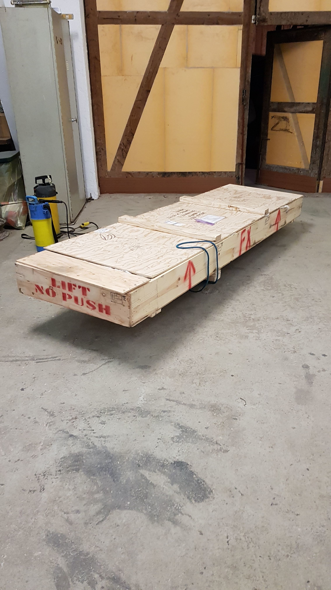

# Empennage

### Shipping

It took three weeks from ordering the Empennage Kit until delivery in southern Germany. Van's needed one week to prepare and ship the crate. Then it took four days until the crate was flown to Germany by FedEx. Customs in Cologne was a little challenge as they wanted to see an airworthyness certificate for the parts \(which I do not have because it's an experimental plane\). After clarifying that they still asked to inspect the shipment which delayed the delivery by one more day. In Germany FedEx does not do freight delivery. So they have subcontracted TNT for delivery. Unfortunately TNT has had a little backlog which resulted in a short delay.

Finally on a Wednesday morning at 7:20 the Empennage Kit has arrived!

### Inventory

I was expecting more parts to do inventory on. The shipping list was about six to seven pages long and it took less then a day to do the inventory. In the end three parts were missing: Some washers \(which shouldn't be a problem to get in a hardware store\), and two aluminum parts. I will ask Van's to send them to me.

