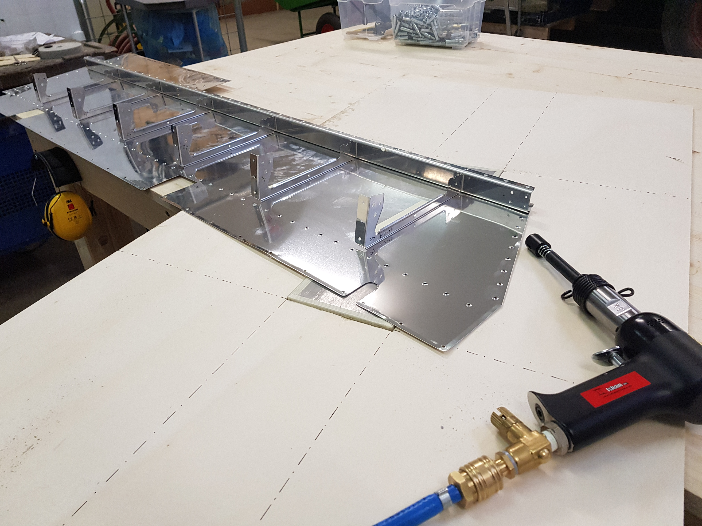
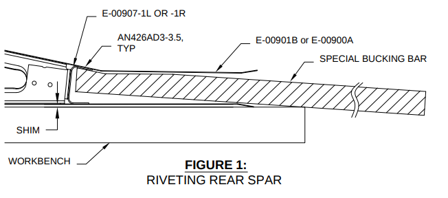
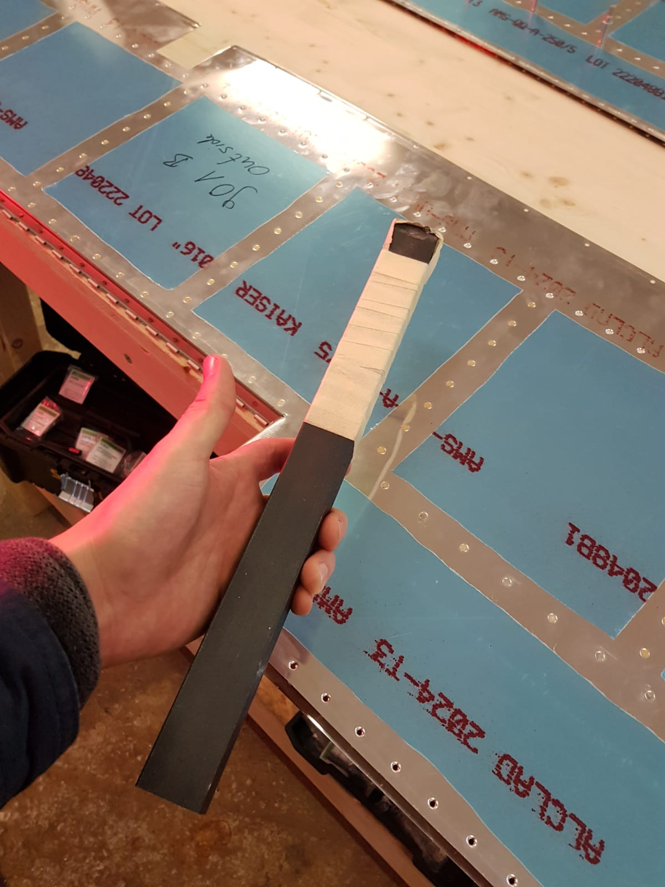
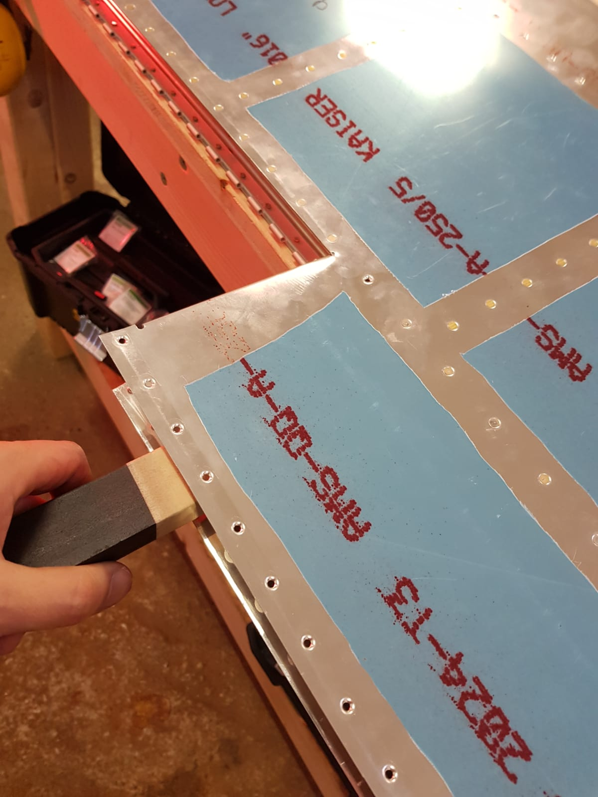
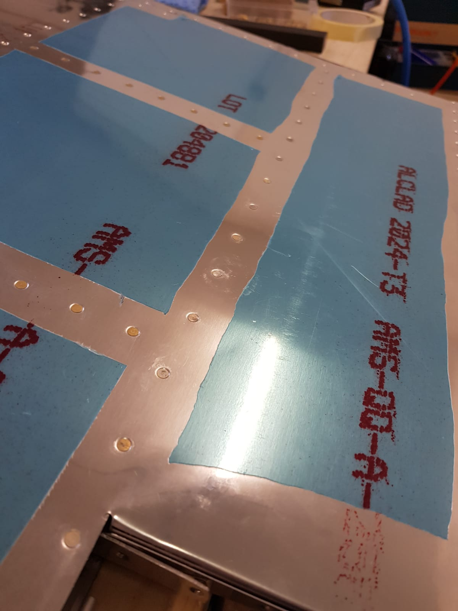
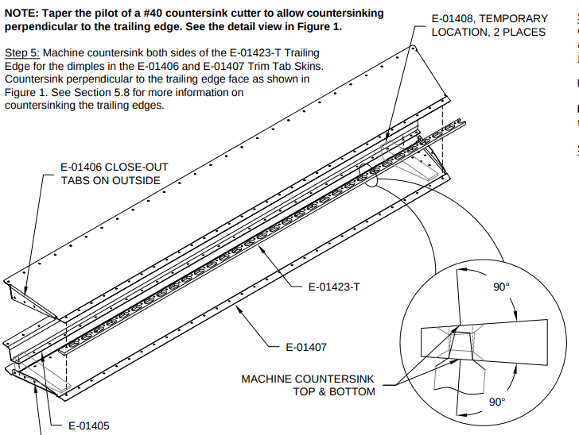
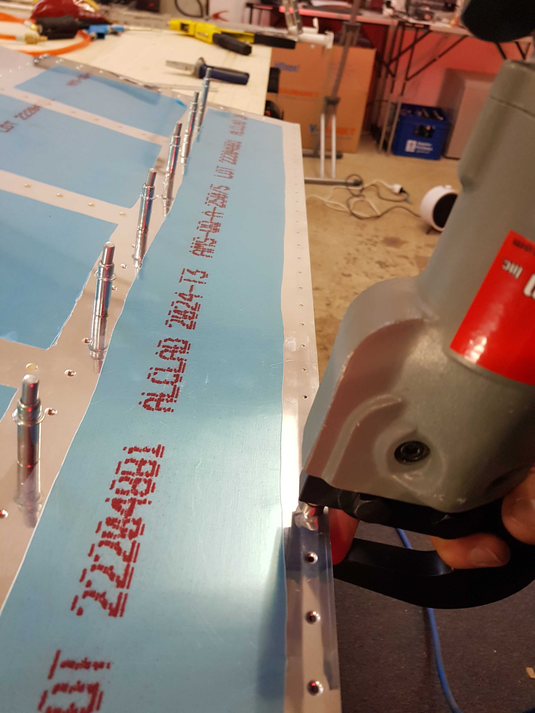
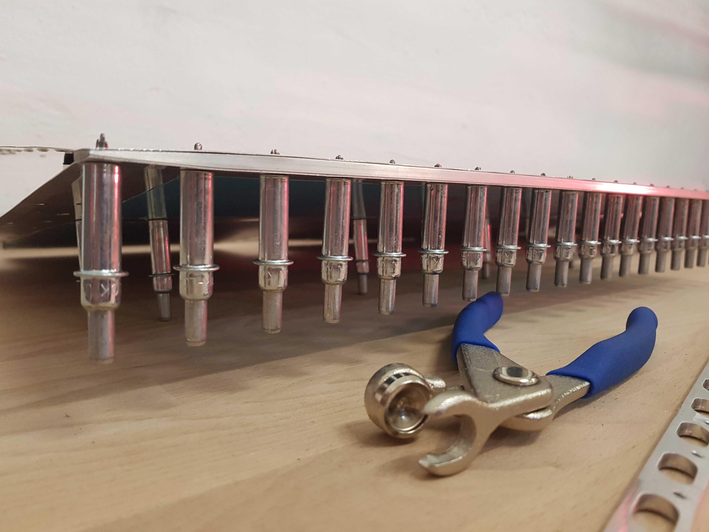

# Elevator

The elevator has a lot of parts. I started building the elevator end of November 2018. Unfortunately I could not really work on it in December. In January I had totally forgotten what I've already done so I had to check every step of the build and try to remember.

Learning: Mark the steps I have completed in the build manual!

Plans: [https://www.vansaircraft.com/wp-content/uploads/2019/01/RV-14\_09.pdf](https://www.vansaircraft.com/wp-content/uploads/2019/01/RV-14_09.pdf)

### Elevator Substructure

The elevator substructure is similar to the substructure in the rudder. You back rivet the ribs to one skin. Differently than the rudder the second skin will be riveted using the rivet gun and bucking bar. This is pretty straight forward and not very difficult.

### Elevator Rear Spar

The access to the rear spar for the bucking bar is quite restricted. Van's recommends to use a long piece of steel to reach this place. I have ordered some S235 steel from Thyssen Krupp \(materials4me.de\). Using this the riveting has worked far better than I had expected!

### Trailing Edge

The trailing edge is a wedge that sits between the upper and the lower skin. It has to be counter sunk from both sides. The holes in this wedge are not perpendicular to the wedge surface. Therefore a standard counter sink bit is not suitable. You have to taper the pilot of the counter sink so you are able to position the counter sink bit perpendicular to the surface.

The skins will then get slightly broken and dimpled so you have flush rivets in the end and the skin lies tightly on the trailing edge.

