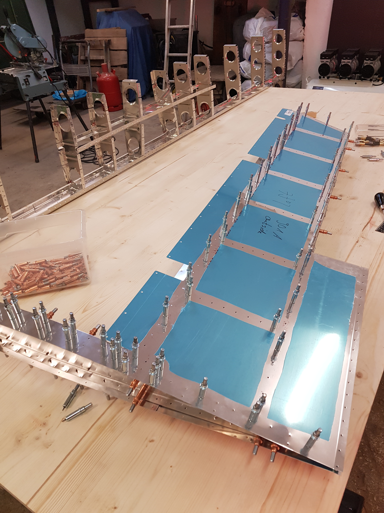

# Elevator

The elevator has a lot of parts. I started building the elevator end of November 2018. Unfortunately I could not really work on it in December. In January I had totally forgotten what I've already done so I had to check every step of the build and try to remember.

Learning: Mark the steps I have completed in the build manual!

Plans: [https://www.vansaircraft.com/wp-content/uploads/2019/01/RV-14\_09.pdf](https://www.vansaircraft.com/wp-content/uploads/2019/01/RV-14_09.pdf)

