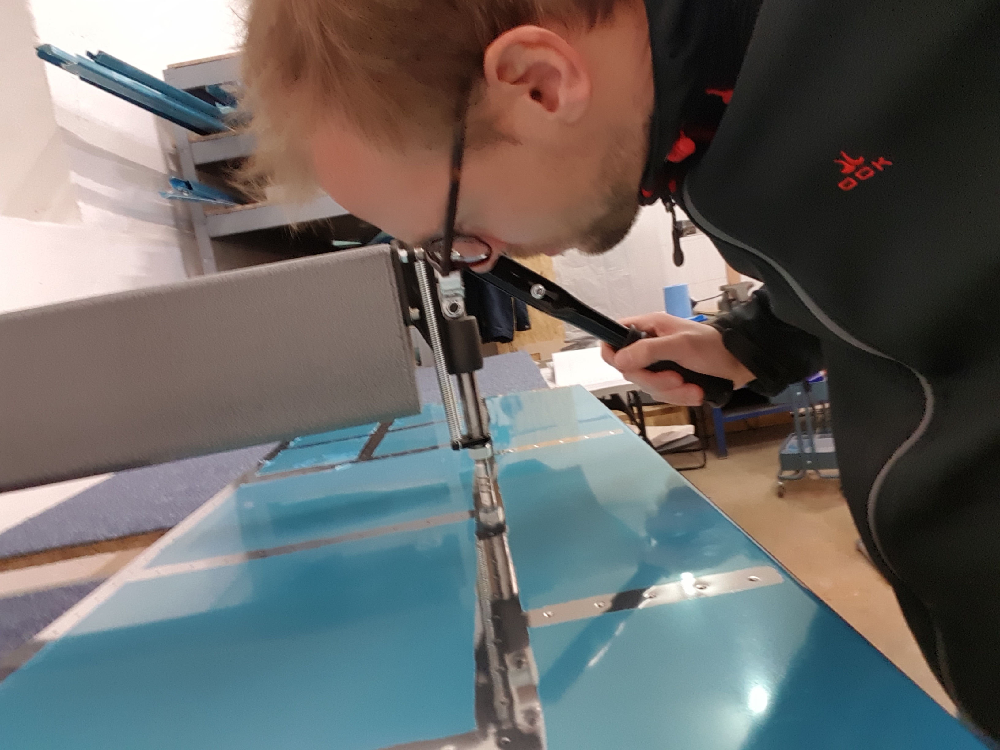
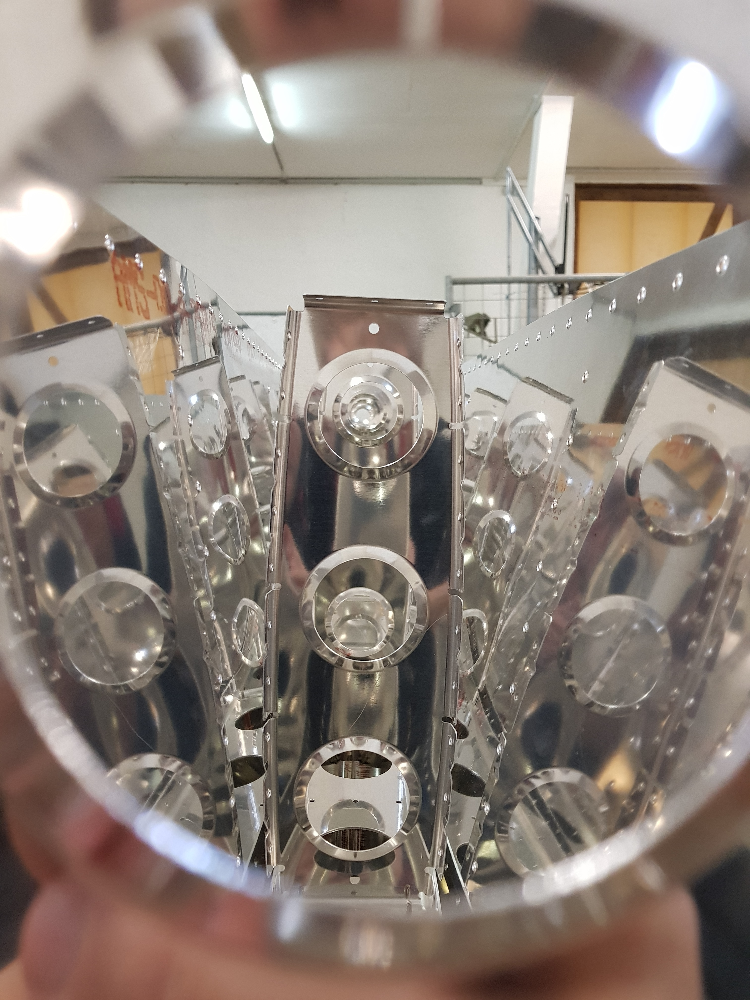

# Horizontal Stabilizer

Plans: [https://www.vansaircraft.com/wp-content/uploads/2019/01/RV-14\_08.pdf](https://www.vansaircraft.com/wp-content/uploads/2019/01/RV-14_08.pdf)

When building the horizontal stabilizer \(HS\) you build the rear spar first, then the substructure and then rivet the nose ribs to the skins. After these worksteps I had to stop working on the HS and wait for the examiner to inspect my work on the nose ribs and the substructure as you cannot really look at the internal structure after proceeding. The next steps are riveting the substructure to the skins and adding the HS rear spar.

