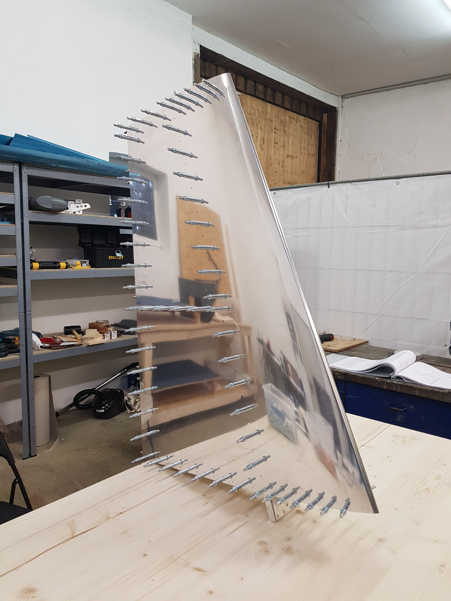
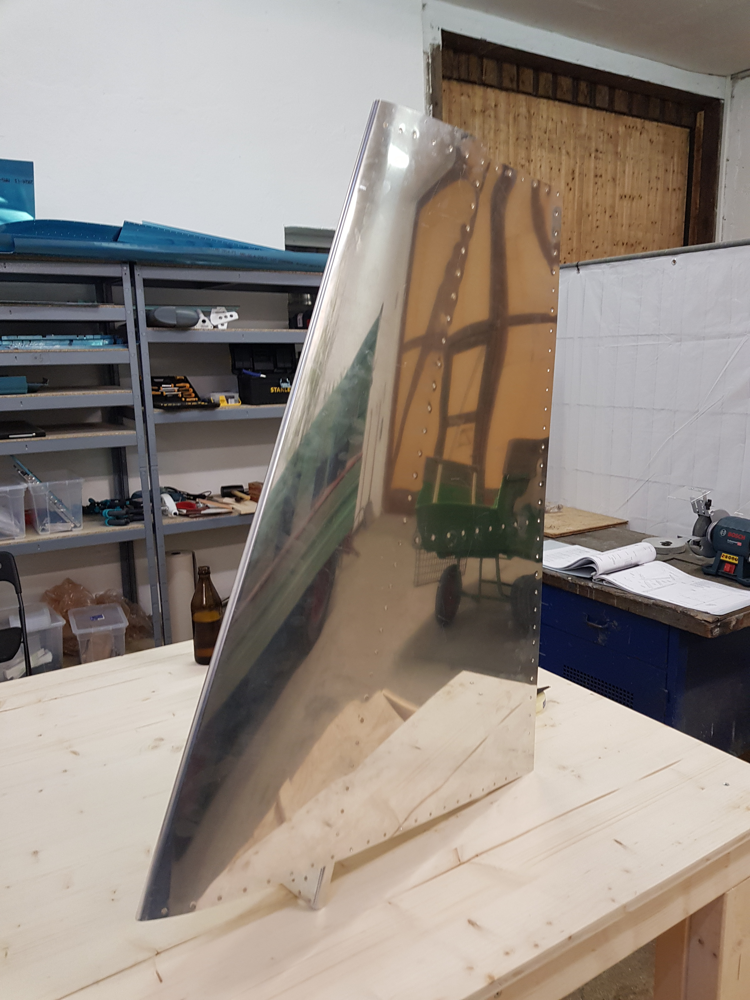

# Vertical Stabilizer

The first step in building the RV-14 is making the vertical stabilizer. That means clecoing everything together, final drill the holes, uncleco everything, deburring, dimpling, recleco and then riveting.

