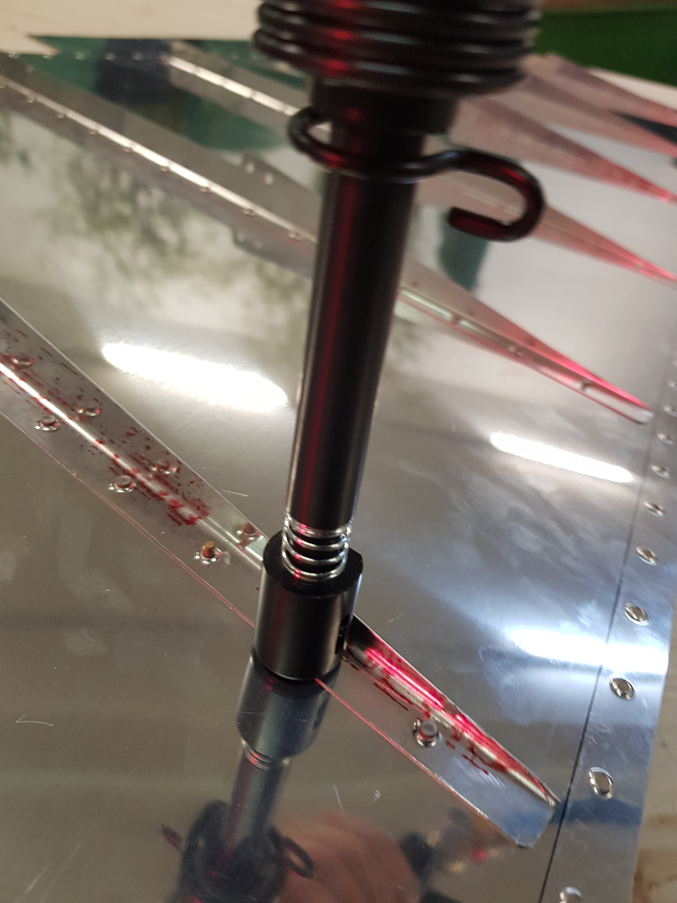
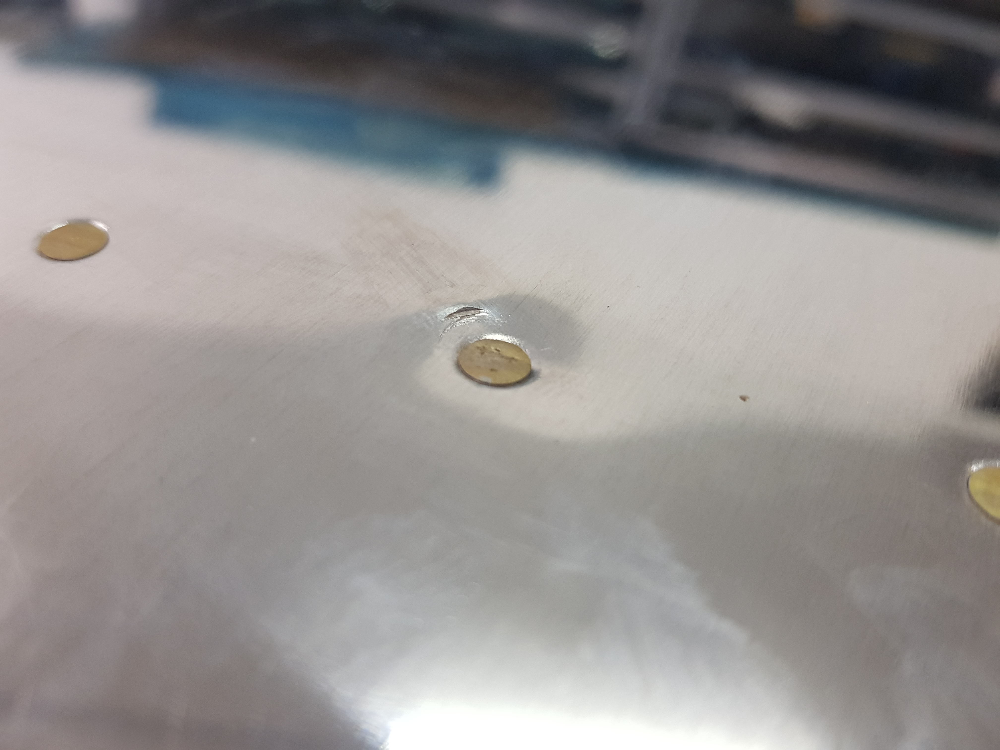

# Back Riveting

_**DO NOT BACK RIVET WITHOUT A BACK RIVETING PLATE!**_

"_Back riveting means holding the bucking bar on the factory head of the rivet and driving instead from the shop end with the rivet gun and a special back rivet set. The basic rivet set has a spring loaded sleeve that helps keep the metal pieces firmly together, and prevents the rivet set from accidentally slipping of the rivet._" \(RV-14 construction plans, section 5.6\)

I have tried to do that with my tungsten bucking bar as back riveting plate. It works! But it is a bit small. So there will come the one rivet where the bucking bar is not positioned perfectly beneath your rivet. The moment you will shoot the rivet gun you will make dents into your skin.

I have ordered a piece of stainless V2A steel \(450 x 120 x 8mm - about 3.5kg\) that I will use as a back riveting plate in the future.

My new back riveting plate has arrived and I had the chance to try it on my elevator skins. It works really great! The only thing I have noticed: When you position it in the middle of the table the table itself dampens the rivet gun's hits. So I do the back riveting near the table's stiffeners.

