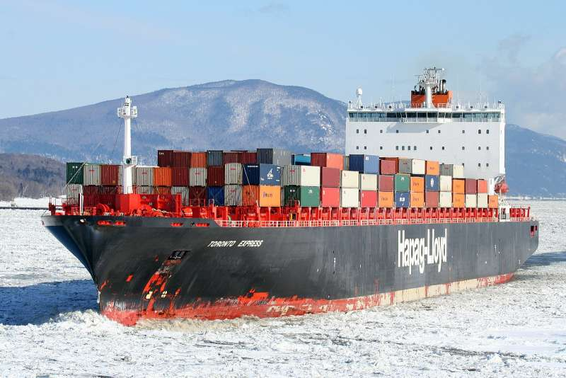

# Wings

## Shipping

My wings build kit will be loaded onto the QUEBEC EXPRESS and will leave Montreal for Hamburg on Feb. 1st, 2019. The vessel's position can be tracked via [https://www.vesselfinder.com/de/?imo=9294836](https://www.vesselfinder.com/de/?imo=9294836) as long as the vessel is near a radio receiver on land. Expected arrival in Hamburg is Feb 16th.

It turns out that my wings container has missed the ship because of the famous polar vortex in January 2019 that has deep frozen half of the USA. So the next ship goes at Jan 12th. The Toronto Express from Hapag-Lloyd. It's a sister ship of the Quebec Express. Expected arrival in Hamburg is January 23rd.

